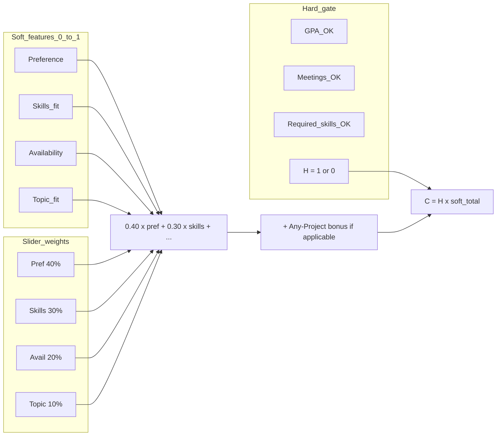

# How one student–project pair is scored

```mermaid
flowchart LR
  subgraph hard [Hard_gate]
    GPA[GPA_OK]
    Meet[Meetings_OK]
    Skills[Required_skills_OK]
    H["H = 1 or 0"]
  end

  subgraph soft [Soft_features_0_to_1]
    Pref[Preference]
    Sk[Skills_fit]
    Avail[Availability]
    Topic[Topic_fit]
  end

  subgraph weights [Slider_weights]
    W1["Pref 40%"]
    W2["Skills 30%"]
    W3["Avail 20%"]
    W4["Topic 10%"]
  end

  Pref --> Mix["0.40 x pref + 0.30 x skills + ..."]
  Sk --> Mix
  Avail --> Mix
  Topic --> Mix
  W1 --> Mix
  W2 --> Mix
  W3 --> Mix
  W4 --> Mix
  Mix --> Plus["+ Any-Project bonus if applicable"]
  H --> Final["C = H x soft_total"]
  Plus --> Final
```

Example numbers for the weight shares above come from sliders 8 / 6 / 4 / 2 (total 20).
