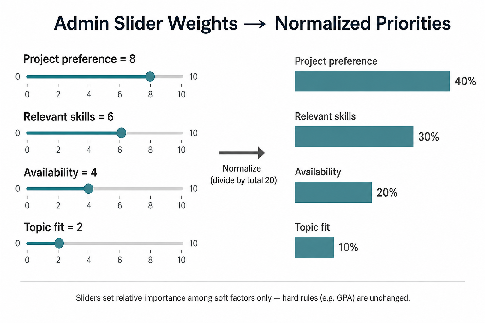
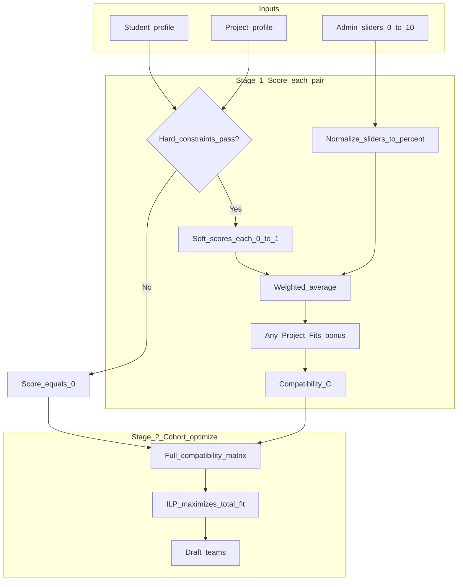

# End-to-end matching pipeline

```mermaid
flowchart TB
  subgraph inputs [Inputs]
    Student[Student_profile]
    Project[Project_profile]
    Sliders[Admin_sliders_0_to_10]
  end

  subgraph stage1 [Stage_1_Score_each_pair]
    Hard{Hard_constraints_pass?}
    Soft[Soft_scores_each_0_to_1]
    Norm[Normalize_sliders_to_percent]
    Mix[Weighted_average]
    Bonus[Any_Project_Fits_bonus]
    Score[Compatibility_C]
  end

  subgraph stage2 [Stage_2_Cohort_optimize]
    Matrix[Full_compatibility_matrix]
    ILP[ILP_maximizes_total_fit]
    Draft[Draft_teams]
  end

  Student --> Hard
  Project --> Hard
  Hard -->|No| Zero[Score_equals_0]
  Hard -->|Yes| Soft
  Sliders --> Norm
  Soft --> Mix
  Norm --> Mix
  Mix --> Bonus
  Bonus --> Score
  Zero --> Matrix
  Score --> Matrix
  Matrix --> ILP
  ILP --> Draft
```

Also see the linear Stage-1 diagram in [architecture-plan.md](../architecture-plan.md).
